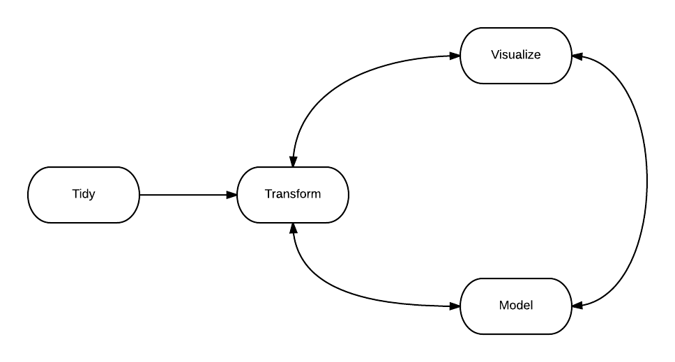

```{r pacotes, echo=FALSE, message=FALSE, warning=FALSE}
# library(dplyr)
# library(tidyr)
# library(pander)
# 
# data(pnud_muni, package = 'abjutils')
# names(pnud_muni)[names(pnud) %>% stringr::str_detect("(Muni)?(pio)")] <- "municipio"
```

## Hadley Wickham


## Hadley Wickham

> “(...) The fact that data science exists as a field is a colossal failure of statistics. To me, [what I do] is what statistics is all about. It is gaining insight from data using modelling and visualization. Data munging and manipulation is hard and statistics has just said that’s not our domain.”


## Manipulação de dados com dplyr

- A manipulação de dados é usualmente dolorosa e demorada.
- Os dados vêm cada vez mais sujos.
- Tarefa negligenciada no mundo acadêmico.

## Introdução

- O `dplyr` é o pacote mais útil para manipulação de dados.
- Aliar simplicidade e eficiência de forma elegante. 
- Legível, eficiente e produtivo.
- Pode ser considerado uma revolução da forma de programar em `R`.


## Introdução

```{r}
library(dplyr)
data(pnud_muni, package = 'abjutils')
```

## `tbl` e `tbl_df`

```{r, eval=FALSE}
pnud_muni <- tbl_df(pnud_muni)
pnud_muni
```

## Introdução

### Filosofia do Hadley para análise de dados



## Introdução

### As cinco funções principais do dplyr

- `select`
- `filter`
- `mutate`
- `arrange`
- `summarise`

## Introdução

### Características

- O _input_  é sempre um `data.frame` (`tbl`).
- O _output_  é sempre um `data.frame` (`tbl`).
- O primeiro argumento é o `data.frame`.
- A utilização é facilitada com o emprego do operador `%>%`

### Vantagens

- Utiliza `C` e `C++` por trás da maioria das funções.
- Trabalhar com diferentes fontes de dados, como bases relacionais (SQL) e `data.table`.

## select {.build}

- Utilizar `starts_with(x)`, `contains(x)`, `matches(x)`, `one_of(x)`, etc.
- Colocar nomes, índices, e intervalos de variáveis com `:`.

## select {.build}

```{r, eval=FALSE}
# por indice (nao recomendavel!)
pnud_muni %>%
  select(1:10)
```

## select {.build}

```{r, eval=FALSE}
# especificando nomes (maneira mais usual)
pnud_muni %>%
  select(ano, uf, municipio, idhm)
```

## select {.build}

```{r, eval=FALSE}
# intervalos e funcoes auxiliares (para economizar trabalho)
pnud_muni %>%
  select(ano:municipio, starts_with('idhm'))
```

## Exercício

Selecione município, estado, ano, coeficiente de gini e todas as medidas de idhm.

## filter

- Parecido com `subset`.
- Condições separadas por vírgulas é o mesmo que separar por `&`.

## filter

```{r, eval=FALSE}
# somente estado de SP, com IDH municipal maior que 80% no ano 2010
pnud_muni %>%
  select(ano, ufn, municipio, idhm) %>%
  filter(ufn==35, idhm > .8, ano==2010)
```

## filter

```{r, eval=FALSE}
# mesma coisa que o anterior
pnud_muni %>%
  select(ano, ufn, municipio, idhm) %>%
  filter(ufn==35 & idhm > .8 & ano==2010)
```

## filter

```{r, eval=FALSE}
# !is.na(x)
pnud_muni %>%
  select(ano, ufn, municipio, idhm, pea) %>%
  filter(!is.na(pea))
```

## filter

```{r, eval=FALSE}
# %in%
pnud_muni %>%
  select(ano, ufn, municipio, idhm) %>%
  filter(municipio %in% c('CAMPINAS', 'SÃO PAULO'))
```

## Exercício

Selecione ano, município, ufn, gini e as medidas de idh, e depois filtre apenas para os
casos em que o ano é 2010, o coeficiente de Gini é maior que 0.5 ou o idhm é maior que 0.7

## mutate

- Parecido com `transform`, mas aceita várias novas colunas iterativamente.
- Novas variáveis devem ter o mesmo `length` que o `nrow` do bd oridinal ou `1`.

## mutate

```{r, eval=FALSE}
# media de idhm_l e idhm_e
pnud_muni %>%
  select(ano, ufn, municipio, starts_with('idhm')) %>%
  filter(ano == 2010) %>%
  mutate(idhm2 = (idhm_e + idhm_l) / 2)
```

## mutate

```{r, eval=FALSE}
# errado
pnud_muni %>%
  select(ano, ufn, municipio, starts_with('idhm')) %>%
  filter(ano==2010) %>%
  mutate(idhm2 = mean(c(idhm_e, idhm_e)))

# uma alternativa (+ demorada)
pnud_muni %>%
  select(ano, ufn, municipio, starts_with('idhm')) %>%
  filter(ano==2010) %>%
  rowwise %>%
  mutate(idhm2 = mean(c(idhm_e, idhm_l)))
```

## Exercício

Selecione ano, município, ufn, gini e as medidas de idh, depois filtre apenas para os
casos em que o ano é 2010, e depois escreva o idhm em forma de porcentagem, com 1 casa decimal

## arrange

- Simplesmente ordena de acordo com as opções.
- Utilizar `desc` para ordem decrescente.

## arrange

```{r, eval=FALSE}
pnud_muni %>%
  select(ano, ufn, municipio, idhm) %>%
  filter(ano==2010) %>%
  mutate(idhm_porc = idhm * 100,
         idhm_porc_txt = paste(idhm_porc, '%')) %>%
  arrange(idhm)
```

## arrange

```{r, eval=FALSE}
pnud_muni %>%
  select(ano, ufn, municipio, idhm) %>%
  filter(ano==2010) %>%
  mutate(idhm_porc = idhm * 100,
         idhm_porc_txt = paste(idhm_porc, '%')) %>%
  arrange(desc(idhm))
```

## Exercício

Obtenha os 10 municipios com maior idhm em 2010 e mostre esses idhm./

## summarise

- Retorna um vetor de tamanho `1` a partir de uma conta com as variáveis.
- Geralmente é utilizado em conjunto com `group_by`.
- Algumas funções importantes: `n()`, `n_distinct()`.

## summarise

```{r, eval=FALSE}
pnud_muni %>%
  filter(ano==2010) %>%  
  group_by(ufn) %>%
  summarise(n=n(), 
            idhm_medio=mean(idhm),
            populacao_total=sum(popt)) %>%
  arrange(desc(idhm_medio))
```

## summarise

```{r, eval=FALSE}
pnud_muni %>%
  filter(ano == 2010) %>%  
  count(ufn)
```

## summarise

```{r, eval=FALSE}
pnud_muni %>%
  group_by(ano, ufn) %>%
  tally() %>%
  head # nao precisa de parenteses!
```

## Exercício

Calcule a expectativa de vida média de cada estado, ponderada pela população dos municípios no ano 2000.

# Data Tidying com `tidyr`

## Data Tidying com tidyr

- Cada observação é uma linha do bd.
- Cada variável é uma coluna do bd.
- Para cada unidade observacional temos um bd separado (possivelmente com chaves de associacao).

```{r}
library(tidyr)
```

## spread

- "Joga" uma variável nas colunas

```{r, eval=FALSE}
pnud_muni %>%
  group_by(ano, ufn) %>%
  summarise(populacao=sum(popt)) %>%
  ungroup() %>%
  spread(ano, populacao)
```

## gather

- "Empilha" o banco de dados

```{r, eval=FALSE}
pnud_muni %>%
  filter(ano == 2010) %>%
  select(ufn, municipio, starts_with('idhm_')) %>%
  gather(tipo_idh, idh, starts_with('idhm_'))
```

## Exercício

Verifique se `gather(spread(dados))`, `spread(gather(dados))` e `dados` são equivalentes.

## Funções auxiliares

- `unite` junta duas ou mais colunas usando algum separador (`_`, por exemplo).
- `separate` faz o inverso de `unite`, e uma coluna em várias usando um separador.

## Um pouco mais de manipulação de dados

- Para juntar tabelas, usar `inner_join`, `left_join`, `anti_join`, etc.
- Para realizar operações mais gerais, usar `do`.
- Para retirar duplicatas, utilizar `distinct`.

## Outros pacotes úteis para limpar bases de dados

- `stringr` para trabalhar com textos.
- `lubridate` para trabalhar com datas.
- `rvest` para trabalhar com arquivos HTML.

<hr/ >
